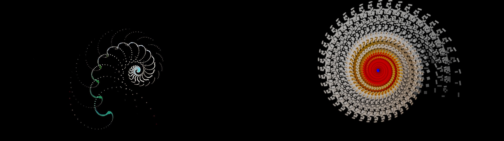
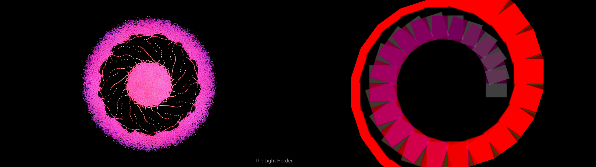

# lightherder

A GPU video-feedback instrument in Rust and wgpu: virtual cameras and monitors
recirculate images into spirals, rings and repeating patterns. This is an
unaffiliated software homage to Dave Blair's [The Light Herder](https://www.thelightherder.com/),
realizing its feedback rig in software; Blair's instrument creates its images
through analog video and optical feedback.

## What it looks like

Existing recipe comparisons: Blair's original on the left, this software on the
right ([sources](recipes/SOURCES.md)).





## Build and run

From the checkout, with Nix installed and a graphics driver available:

```sh
nix-shell --run 'cargo build --release'
nix-shell --run 'cargo run --release -- --windowed --seed bars'
```

This opens a window with a generated test pattern as its input. Close the window
to quit. Plug in a Korg nanoKONTROL2 to play the instrument on Linux.

| Option | Effect |
| --- | --- |
| `--windowed` | Open a window; fullscreen is the default. |
| `--resolution WIDTHxHEIGHT` | Set each virtual monitor's size; default `1920x1080`. |
| `--seed bars` | Use the built-in test pattern. |
| `--seed FORMAT:NAME` | Read an ffmpeg input, e.g. `lavfi:testsrc2`; default `v4l2:/dev/video0`. |
| `--bench` | Time 600 frames off screen and exit. |
| `--help` | Print command-line usage. |

## Presets and controls

The instrument starts at identity, passing the input through the monitor bank.
[Recipes](recipes/README.md) give control sequences for eight looks; there is no
preset selector. The nanoKONTROL2 controls below act on the selected camera,
monitor or switcher; Cycle shows their values on screen.

| Control | Action |
| --- | --- |
| S1–S3 | Select camera A, B or 3. |
| M1–M5 | Select upper A, lower A, upper B, lower B or the rotating monitor. |
| R1–R4 | Select switcher A, B, C or D. |
| Faders 1–6 | Monitor hue, saturation, brightness, contrast, temperature, sharpness. |
| Faders 7–8 | Switcher reversal period (0–60 passes; 0 disables it), crossfade. |
| Rotaries 1–3 | Camera zoom, rotation, delay (0–2 extra frames). A and 3 share zoom and rotation. |
| Rotary 4 | Monitor frame rate: 60, 30 or 24. |
| Rotary 5 | Precision: a full movement spans 1/64 to all of a continuous control's range. |
| R5 / Marker ◀ | Reverse the switcher crossfade / reverse while held. |
| R6 / R7 | Flip the monitor horizontally / vertically. |
| R8 | Select direct camera feed or switcher output on a structure monitor. |
| Rewind / Stop | Reset the last knob moved / reset all knobs. |
| Marker ▶ | Clear the monitors. |
| Forward / Cycle | Toggle solo monitor view / control overlay. |
| Marker Set / Record | Save a still / record while held, in `~/lightherder`. |
| Play | Record the monitor knobs while lit, for up to ten minutes; press again to loop the ones that moved, again to stop. Turning or resetting a looping knob takes it out of the loop. |

Faders and rotaries 1–4 change values by movement. To start feedback, select
switcher B with R2 and lower fader 8, then select camera B with S2 and turn its
zoom and rotation slightly.

## Topology

Three virtual cameras only ever watch monitors: A and B each see a pair through
50/50 glass, and camera 3 watches the fifth, rotating monitor.
Four switchers route camera feeds back to the monitors, with the fifth monitor
always showing camera B.
External inputs enter on the mix side as switcher D's luma-keyed seed over camera 3.
