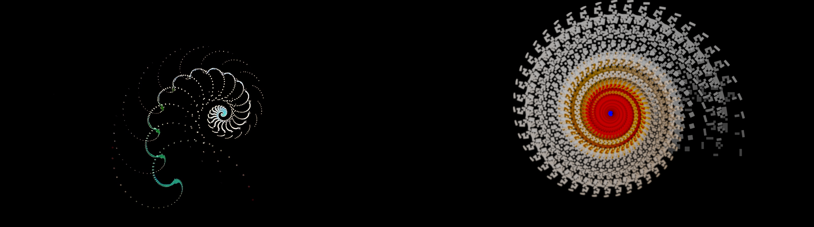
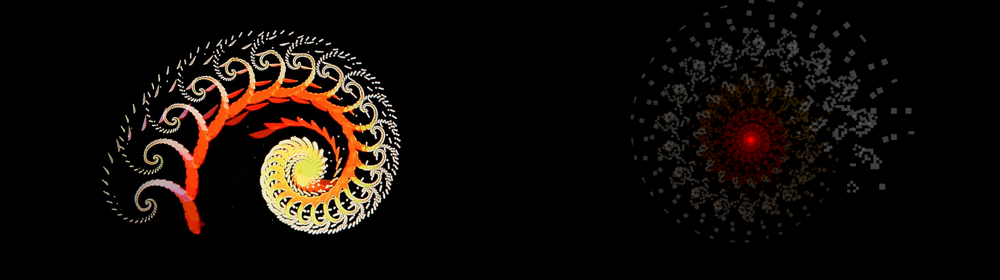
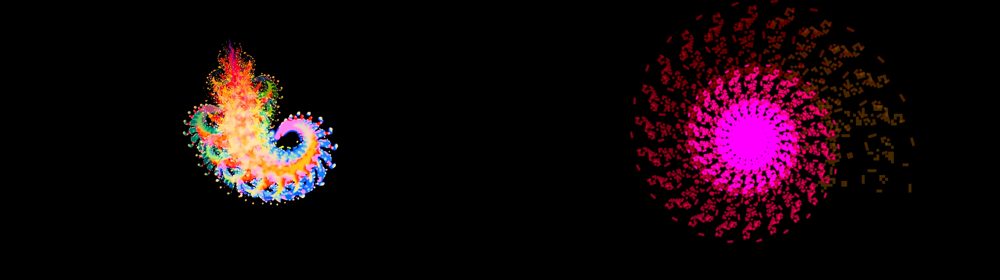
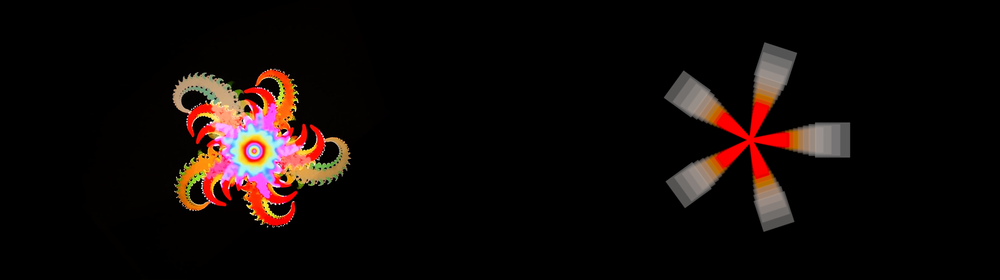
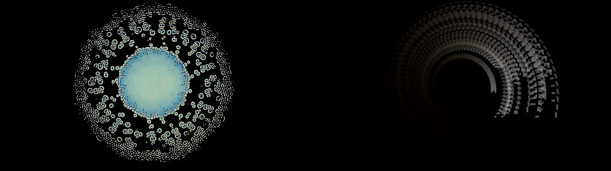
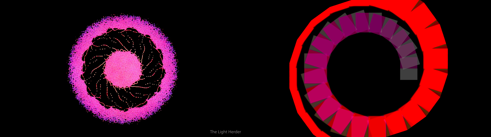
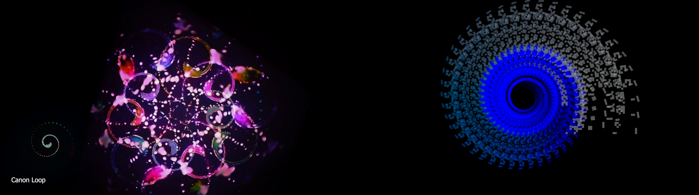
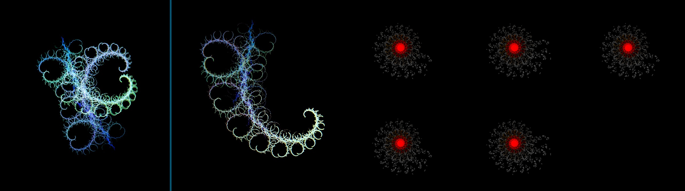

# Recipes

Eight scenes from Dave Blair's published Light Herder work, and what it takes to
reach each one on this rig. Every recipe starts from **■ stop** — the whole panel
back to identity — and is written in the control surface's own vocabulary: a select
row picks a node, a fader turns the knob it points at by how far it moves, and
the **precision rotary** (rotary 5) says what a full throw is worth, from a
sixty-fourth of a knob's travel to the whole of it; it sits at a quarter until
a hand moves it. `+1 throw` is fader 8 run from
one end of its travel to the other; a fraction is that fraction of the travel.

Each section carries the reference frame beside ours, the rig-state the recipe lands
on so it can be checked against the code, and whether it came out.

The frames here were rendered off screen by `examples/recipe`, which plays the same
written sequence into `Feedback` and writes the frame with the same `Capture` the
marker-set button uses. Every `recipes/<slug>.txt` beside this file is the script
that produced the right-hand half of that scene's image — the reference frame,
an 8 px gutter, ours, each half scaled to 1280×720 — and `scripts/recipes render`
rebuilds every composite from the scripts. Every seed here is frozen on one
frame, so nothing in a run is left to when the machine got round to it, and
`scripts/recipes check` renders the lot again and fails on any byte that differs
from what is committed: a change to the instrument that moves a picture has to
land with the frames re-rendered and the verdicts below re-read. One scene alone:

```
nix-shell --run "cargo run --release --example recipe -- recipes/single-spiral.txt ours.png"
```

## What the seed has to be

**The seed decides more than any knob.** Every one of these scenes needs a small,
bright, *detailed* subject on an unlit field — which is what the switcher's luma key
is built for. A flat white card gives smooth blocks; a subject with fine grain gives
the filigree the original is known for, because the loop magnifies its own grain a
little every pass. That is the whole difference between a smeared spiral and one
made of hundreds of legible copies, and it is the first thing to change when a
recipe looks close but coarse.

The artist's own seeds are exactly that: two dots on a phone, the word "Fractal", a
painting, a live fish tank. These recipes name theirs on a `seed` line the harness
reads, and the instrument takes the same spelling as `--seed FORMAT:NAME`.

## The three levers that shape a scene

- **zoom** decides whether the copies walk inward (a nautilus) or outward (an
  annulus). It is the sensitive one: `0.966` and `1.028` are opposite scenes, and
  everything worth playing lives inside a couple of percent of `1.000`.
- **rotation** decides how far apart consecutive copies land. Under a degree a pass
  the trail is a smear; a fifth of a radian and it is a chain of legible crescents;
  at `2π/n` exactly it closes into an `n`-fold rosette.
- the **switcher** decides how long the trail is. Run hard toward its own camera the
  loop keeps almost everything and the arm runs for fifty copies; a tenth of the way
  back and it is a dozen. It is also the only way light gets in, so a switcher run
  all the way to its camera makes a loop that fades to black.

**Saturation, not brightness.** Each camera's gain is a per-channel loss — A's blue
survives best, B's red does — so a white seed comes back tinted by the structure it
went round, warm out of B and cool out of A, and the saturation fader is what makes
that visible. Brightness inside a loop compounds into a flat white disc within a few
hundred passes; every recipe here leaves it alone.

---

## single-spiral — the Nautilus



A sparse white nautilus of dotted circle-outlines, one clean logarithmic spiral winding about four turns into a bright core, with a faint cool tail. <https://vimeo.com/502302153>.

**Recipe** (from ■):

```
S1                       focus camera A — the structure the cool tail comes from
R1                       focus switcher A
rotary 5 to the top       precision 1/1: a full throw is now the whole travel
fader 8  -0.95 throw     switcher A almost to In1: camera A's own loop, a twentieth of a
                         seed left in to keep feeding it
rotary 5 to two-thirds    precision 1/4 again, which is where it starts
rotary 1 -0.02 throw     zoom 0.986 — the copies walk inward
rotary 2 +0.09 throw     rotation +0.141 rad a pass — about eight degrees, far enough
                         apart that each copy reads
M1                       focus monitor upper A
fader 2  +0.20 throw     saturation 1.20 — lifts the tint the camera's own gain put there
                         (300 passes)
▶▶                       solo the monitor
```

**Lands on:**

```
rig: zoom 0.9862 rotation +0.1414
switchers [0.050, 1.000, 1.000, 1.000] periods [0, 0, 0, 0]
selects ["program", "program", "program", "program"]
mon 1/5: hue +0.000  sat 1.200  bright +0.000  contrast 1.000  temp +0.0  sharp 0.000  flip [false, false]  rate 60/60  program  shows 0.950 of cam 1
```

**Reproduced** in form. The turn count and the arm's taper land, and the outer arm
carries the cool cast; the core comes out warm where the original's is cool, and
ours is coarser at the outer end, where the original's copies each carry a spiral of
their own.

## dense-orange-spiral



A dense orange and cream spiral: about fifteen nested scalloped crescents unwinding from a yellow eye, each crescent itself scalloped. <https://www.youtube.com/watch?v=KqHgCx4Lk_w>.

**Recipe** (from ■):

```
S2                       focus camera B — the structure whose red survives
R2                       focus switcher B
rotary 5 to the top       precision 1/1
fader 8  -0.95 throw     switcher B to 0.05: structure B's own loop
rotary 5 to two-thirds    precision 1/4
rotary 1 -0.05 throw     zoom 0.966 — a strong pull inward, so the arm is short and steep
rotary 2 +0.22 throw     rotation +0.346 rad — twenty degrees a copy
M3                       focus monitor upper B
fader 2  +0.30 throw     saturation 1.30
                         (150 passes)
▶▶                       solo
```

**Lands on:**

```
rig: zoom 0.9659 rotation +0.3456
switchers [1.000, 0.050, 1.000, 1.000] periods [0, 0, 0, 0]
selects ["program", "program", "program", "program"]
mon 3/5: hue +0.000  sat 1.300  bright +0.000  contrast 1.000  temp +0.0  sharp 0.000  flip [false, false]  rate 60/60  program  shows 0.000 of cam 1
```

**Reproduced.** Same coil, same warm core against a cream outer arm — the warmth is
camera B's own gain, not a knob.

## rainbow-nautilus



One spiral arm sweeping across the frame, about ten nested copies, the colour running the whole ramp from red to cyan along the arc. <https://vimeo.com/688222461>.

**Recipe** (from ■):

```
as dense-orange-spiral, with a coloured seed, and then
rotary 1 -0.04 throw     zoom 0.973
rotary 2 +0.18 throw     rotation +0.283 rad
M3
fader 2  +0.40 throw     saturation 1.40
fader 1  +0.05 throw     hue +0.079 rad a pass — the phase walks the trail through the
                         spectrum, one step further for every copy further in
                         (200 passes)
▶▶
```

**Lands on:**

```
rig: zoom 0.9727 rotation +0.2827
switchers [1.000, 0.050, 1.000, 1.000] periods [0, 0, 0, 0]
selects ["program", "program", "program", "program"]
mon 3/5: hue +0.079  sat 1.400  bright +0.000  contrast 1.000  temp +0.0  sharp 0.000  flip [false, false]  rate 60/60  program  shows 0.000 of cam 1
```

**Reproduced.** Hue is a phase here, so it turns chroma that is already there and does
nothing to a grey: the ramp only appears once the seed carries colour. That is the
whole recipe.

## radial-rosette



A radially symmetric rosette: scalloped arms pinwheeling around a saturated core, no tail. <https://vimeo.com/488820136>.

**Recipe** (from ■):

```
S2 / R2
rotary 5 to the top
fader 8  -0.90 throw     switcher B to 0.10
rotary 5 to two-thirds
rotary 1 -0.03 throw     zoom 0.979
rotary 2 +0.80 throw     rotation +1.257 rad = 2π/5 exactly. Every fifth copy lands on
                         the first, so the arm closes into a rosette instead of a spiral
M3
fader 2  +0.25 throw     saturation 1.25
                         (250 passes)
▶▶
```

**Lands on:**

```
rig: zoom 0.9794 rotation +1.2566
switchers [1.000, 0.100, 1.000, 1.000] periods [0, 0, 0, 0]
selects ["program", "program", "program", "program"]
mon 3/5: hue +0.000  sat 1.250  bright +0.000  contrast 1.000  temp +0.0  sharp 0.000  flip [false, false]  rate 60/60  program  shows 0.000 of cam 1
```

**Reproduced.** The arm count is the rotation: set it to 2π/n and the spiral becomes an
n-fold rosette. Nothing else on the panel decides it.

## lace-galaxy



A circular disc of dense white lace — hundreds of tiny cell-shaped copies filling an annulus around a pale core, near-monochrome. <https://vimeo.com/423901020>.

**Recipe** (from ■):

```
S2 / R2
rotary 5 to the top
fader 8  -0.90 throw
rotary 5 to two-thirds
rotary 1 -0.012 throw    zoom 0.992 — barely inward, so the copies pile up rather than
                         run away
rotary 2 +0.05 throw     rotation +0.079 rad — four degrees, tight enough that the copies
                         overlap into lace
M3
fader 2  +0.10 throw     saturation 1.10 — almost none: this one is a luminance piece
                         (250 passes)
▶▶
```

**Lands on:**

```
rig: zoom 0.9917 rotation +0.0785
switchers [1.000, 0.100, 1.000, 1.000] periods [0, 0, 0, 0]
selects ["program", "program", "program", "program"]
mon 3/5: hue +0.000  sat 1.100  bright +0.000  contrast 1.000  temp +0.0  sharp 0.000  flip [false, false]  rate 60/60  program  shows 0.000 of cam 1
```

**Reproduced** in structure. The lace itself is the seed's grain magnified a little each
pass; with a flat seed the same recipe gives smooth rings and nothing else. The core
comes out a saturated red where the original's is a pale disc — the loop keeps more of
itself than it did, and what it keeps is camera B's warmth.

## magenta-donut



A hot-magenta annulus on black: a speckled outer ring and about twenty swept comma-shaped copies pinwheeling around a centre disc. <https://vimeo.com/936617396>.

**Recipe** (from ■):

```
S2 / R2
rotary 5 to the top
fader 8  -0.95 throw
rotary 5 to two-thirds
rotary 1 +0.04 throw     zoom 1.028 — above one, so the copies blow OUTWARD and leave the
                         middle empty. This is the only lever that turns a spiral into a
                         ring
rotary 2 +0.20 throw     rotation +0.314 rad
M3
fader 2  +0.50 throw     saturation 1.50
                         (200 passes)
▶▶
```

**Lands on:**

```
rig: zoom 1.0281 rotation +0.3142
switchers [1.000, 0.050, 1.000, 1.000] periods [0, 0, 0, 0]
selects ["program", "program", "program", "program"]
mon 3/5: hue +0.000  sat 1.500  bright +0.000  contrast 1.000  temp +0.0  sharp 0.000  flip [false, false]  rate 60/60  program  shows 0.000 of cam 1
```

**Reproduced.** The comma-shaped copies and the black middle are the outward zoom; the
magenta is the seed's, since nothing on this rig invents a hue.

## crossed-lattice — spirals made of spirals



A tiled field rather than a spiral: copies of one loop's whole picture scattered over a second loop's, with the first loop shown inset in the corner so it can be read against the field. <https://vimeo.com/499428683>.

**Recipe** (from ■):

```
R3                       focus switcher C
rotary 5 to the top
fader 8  -0.80 throw     switcher C to 0.20: camera A's picture, plus a fifth of the seed
                         chain still coming through
R2
fader 8  -0.50 throw     switcher B to the middle: structure B shows half its own loop and
                         half structure A's — which is what makes B's spiral out of A's
R1
fader 8  -0.85 throw     switcher A to 0.15: structure A keeps its own loop
rotary 5 to two-thirds
rotary 1 -0.02 throw     zoom 0.986
rotary 2 +0.09 throw     rotation +0.141
M3
fader 2  +0.30 throw     saturation 1.30
                         (220 passes)
▶▶
```

**Lands on:**

```
rig: zoom 0.9862 rotation +0.1414
switchers [0.150, 0.500, 0.200, 1.000] periods [0, 0, 0, 0]
selects ["program", "program", "program", "program"]
mon 3/5: hue +0.000  sat 1.300  bright +0.000  contrast 1.000  temp +0.0  sharp 0.000  flip [false, false]  rate 60/60  program  shows 0.400 of cam 1
```

**Reproduced.** Structure B's copies each carry structure A's spiral, which is the
scene. The two spirals share a turn rate, though, because the shaft is one — see
insanity-mode-pair below.

## insanity-mode-pair — Insanity Mode



The artist's own side-by-side of both monitor structures, each composed entirely of the other, and the two panels looking *different*: a cluster on one side and a single crescent of the same loops on the other. <https://vimeo.com/895461860>.

**Recipe** (from ■):

```
R3                       focus switcher C
rotary 5 to the top
fader 8  -0.95 throw     switcher C to In1 = camera A. Switchers A and B are already at
                         In2 out of the box, so structure A now shows camera B and
                         structure B shows camera A: each is made of the other, and that
                         is the whole of Insanity Mode — one fader from reset
rotary 5 to two-thirds
rotary 1 -0.02 throw     zoom 0.986
rotary 2 +0.10 throw     rotation +0.157
M1  fader 2 +0.30        saturation 1.30 on upper A
M3  fader 2 +0.30        saturation 1.30 on upper B
                         (300 passes)
                         (no solo: the bank shows both structures at once)
```

**Lands on:**

```
rig: zoom 0.9862 rotation +0.1571
switchers [1.000, 1.000, 0.050, 1.000] periods [0, 0, 0, 0]
selects ["program", "program", "program", "program"]
mon 1/5: hue +0.000  sat 1.300  bright +0.000  contrast 1.000  temp +0.0  sharp 0.000  flip [false, false]  rate 60/60  program  shows 0.000 of cam 1
mon 3/5: hue +0.000  sat 1.300  bright +0.000  contrast 1.000  temp +0.0  sharp 0.000  flip [false, false]  rate 60/60  program  shows 0.950 of cam 1
```

**Not reproduced: the two structures cannot differ → #75.** The mutual composition
is right and takes one fader, but every monitor lands on the *same* picture. On the
original the two panels differ because the two cameras are moved independently — they
stand on separate floor stands in the artist's own photographs of the rig. Here `zoom`
and `rotation` are the rig's, one value each, so once the structures are crossed they
evolve identically and Insanity Mode is a mirror rather than a dialogue.

---

## What did not come out, and why

Seven of the eight scenes reproduce as *form*: the coil, the turn count, the
n-fold rosette, the annulus, the tiling of one loop's picture by another. What
this rig does not reach is the original's **density** — the reference frames carry
a second and third level of copy inside every crescent, and ours carry one. Three
things stand between the two, and only one of them is technique:

- **The seed.** Fine structure in the picture comes from fine structure in the
  light that entered. That part is technique, and it is the single biggest lever
  on these images. Fixed: the seed was one camera device written into the graph,
  while the original's second input is a media player showing whatever the piece
  needs — two dots, a word, a painting, a fish tank. `--seed FORMAT:NAME` names
  it. **#74**
- **The switchers crossfaded where the original keys.** A crossfade at `d` dims
  the background loop to `1-d` *everywhere*, including where the incoming picture
  is black. A keyer leaves the background whole and replaces it only where the
  key passes. Inside a loop running at a gain just under one, that difference is
  whether the trail survives the seed at all — and keying a second loop over the
  first is how the original's densest scenes are made. Fixed: M/E D now keys the
  seed over camera 3, and the frames here are rendered with it. **#71**
- **One shaft.** Both cameras share one zoom and one rotation, so two structures
  crossed into each other evolve identically and Insanity Mode comes out a
  mirror. **#75**

Three more found on the way, none of them the reason a scene missed: the playable
band of every continuous knob is a few MIDI codes wide against a travel nobody can
use (**#73**); the delay units reach two frames, hardcoded, where the bank affords
more than twenty at the default resolution and the original dials up to thirty; and
the schematics wire a direct loop between camera 3 and the rotating monitor that
this rig can only close the long way round (**#72**).

## The harness

`examples/recipe` plays a written recipe off screen and writes the frame, so a
recipe can be checked without a display or a surface. It is a dev tool and adds
nothing to the instrument: it turns knobs through `Params::nudge`, steps
`Feedback`, and writes with `Capture`, exactly as the app does. Its script is one
control to a line —

| line | is |
| --- | --- |
| `resolution WxH` | how big every monitor is, before the first pass |
| `seed FORMAT:NAME` | what is on the switcher, as ffmpeg's `-f` and `-i` |
| `cam N` / `mon N` / `sw N` | the S, M and R select rows |
| `turn KNOB THROW` | a fader or rotary moved `THROW` of its travel, signed |
| `precision X` | rotary 5, where X is its travel: the precision is 2^-6(1-X) |
| `select` / `reverse` / `flip x` / `flip y` | R8 / R5 / R6 / R7 |
| `cut` / `release` | marker prev, down and up |
| `blank` | marker next |
| `solo` | ▶▶ |
| `run N` | N passes of the rig's own sixty a second |

Knob names are the instrument's own, with `frame-rate` for the two-word one.
